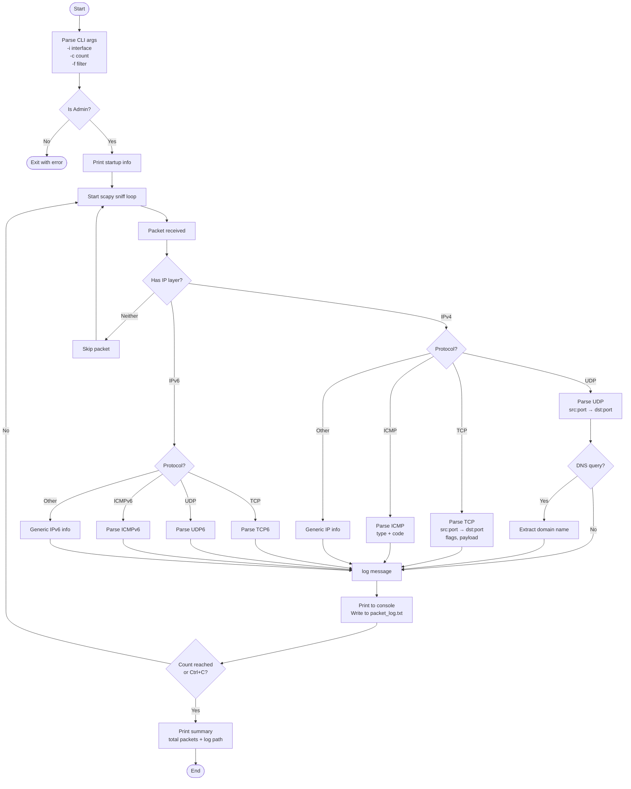

# Advanced Packet Sniffer — Documentation

A Python-based network packet sniffer built with **Scapy**. Captures live traffic on a chosen interface, parses IPv4/IPv6 packets by protocol, prints human-readable output to the console, and saves everything to a log file.

---

## Table of Contents

1. [Requirements](#requirements)
2. [How to Run](#how-to-run)
3. [CLI Arguments](#cli-arguments)
4. [Program Flow](#program-flow)
5. [Flowchart](#flowchart)
6. [Protocol Parsing Logic](#protocol-parsing-logic)
7. [Function Reference](#function-reference)
8. [Output Format](#output-format)
9. [Log File](#log-file)
10. [Common Errors](#common-errors)

---

## Requirements

| Requirement | Notes |
|---|---|
| Python 3.8+ | |
| [Scapy](https://scapy.net/) | `pip install scapy` |
| [Npcap](https://npcap.com/) | Windows only — required for raw packet capture |
| Administrator / root | Must run with elevated privileges |

---

## How to Run

### Step 1 — Open an elevated terminal

- **Windows**: Search *PowerShell* → right-click → **Run as administrator**
- **Linux/macOS**: prefix with `sudo`

### Step 2 — Navigate to the script folder

```
cd "C:\Users\mudas\OneDrive\Desktop\New folder (5)"
```

### Step 3 — Find your interface name (Windows)

```powershell
Get-NetAdapter
```

Common names: `Wi-Fi`, `Ethernet`

### Step 4 — Run

```bash
# Capture 50 packets on Wi-Fi
python basic_packet_sniffer.py -i "Wi-Fi" -c 50

# Capture only HTTP traffic indefinitely
python basic_packet_sniffer.py -i "Wi-Fi" -f "tcp port 80"

# Capture DNS queries only
python basic_packet_sniffer.py -i "Wi-Fi" -f "udp port 53"

# Capture everything, unlimited
python basic_packet_sniffer.py -i "Wi-Fi"
```

---

## CLI Arguments

| Flag | Long form | Default | Description |
|------|-----------|---------|-------------|
| `-i` | `--interface` | `Wi-Fi` | Network interface to sniff on |
| `-c` | `--count` | `0` | Number of packets (0 = unlimited) |
| `-f` | `--filter` | _(none)_ | BPF filter string |

### BPF Filter Examples

| Filter | Captures |
|--------|----------|
| `tcp port 80` | HTTP traffic |
| `tcp port 443` | HTTPS traffic |
| `udp port 53` | DNS queries |
| `icmp` | Ping packets |
| `host 8.8.8.8` | Traffic to/from Google DNS |
| `net 192.168.1.0/24` | Local subnet traffic only |

---

## Program Flow

```
START
  │
  ▼
Parse CLI arguments (-i, -c, -f)
  │
  ▼
Check admin privileges  ──── FAIL ──► Print error & exit
  │
  OK
  ▼
Print startup info (interface, count, filter, log path)
  │
  ▼
Start sniff() loop ◄─────────────────────────────────┐
  │                                                   │
  ▼                                                   │
Receive packet                                        │
  │                                                   │
  ▼                                                   │
packet_handler() called                               │
  │                                                   │
  ├── Has IPv4 layer? ── Yes ──► Parse IPv4 packet    │
  │                                                   │
  ├── Has IPv6 layer? ── Yes ──► Parse IPv6 packet    │
  │                                                   │
  └── Neither? ──────────────► Skip (return)          │
  │                                                   │
  ▼                                                   │
log() — print + write to file                         │
  │                                                   │
  └───────────────────────────────────────────────────┘
  │
  ▼ (count reached OR Ctrl+C)
print_summary() — total packets, log path
  │
  ▼
END
```

---

## Flowchart



---

## Protocol Parsing Logic

### IPv4

```
Packet
 └── IP layer present?
      ├── TCP  → src:port → dst:port, flags, payload (decoded as UTF-8)
      ├── UDP  → src:port → dst:port
      │    └── DNS? → extract query domain
      ├── ICMP → src → dst, type, code
      └── Other → src → dst, protocol number
```

### IPv6

```
Packet
 └── IPv6 layer present?
      ├── TCP   → src:port → dst:port, flags, payload
      ├── UDP   → src:port → dst:port
      │    └── DNS? → extract query domain
      ├── ICMPv6 Echo → src → dst
      └── Other  → src → dst
```

---

## Function Reference

### `is_admin() → bool`
Checks if the process has administrator/root privileges.
- Windows: uses `ctypes.windll.shell32.IsUserAnAdmin()`
- Linux/macOS: checks `os.geteuid() == 0`

### `log(message: str)`
Prepends a timestamp and prints to console + appends to `packet_log.txt`.

### `decode_payload(raw_bytes: bytes) → str`
Attempts to decode the first 60 bytes of a TCP payload as UTF-8. Falls back to `repr()` if decoding fails. Strips newlines for clean single-line output.

### `packet_handler(packet)`
Called by scapy for every captured packet. Identifies the protocol stack, builds a human-readable info string, and calls `log()`. Increments the global `packet_count`.

### `print_summary()`
Prints total captured packet count and the path to the log file after sniffing ends.

### `start_sniffing(interface, count, bpf_filter)`
Entry point for the sniffing session. Validates privileges, converts empty filter to `None`, then calls `scapy.sniff()`.

---

## Output Format

Each line printed to the console and log file follows this format:

```
[YYYY-MM-DD HH:MM:SS] PROTO  SRC:PORT -> DST:PORT  extra_info
```

### Examples

```
[2026-06-20 14:32:01] TCP  192.168.1.5:54321 -> 142.250.80.46:443  flags=PA  payload="GET / HTTP/1.1"
[2026-06-20 14:32:01] UDP  192.168.1.5:52345 -> 8.8.8.8:53  DNS query: www.google.com
[2026-06-20 14:32:02] ICMP 192.168.1.5 -> 8.8.8.8  type=8 code=0
[2026-06-20 14:32:03] UDP6 fe80::1:60423 -> fe80::2:53  DNS query: api.example.com
```

### TCP Flags Reference

| Flag | Meaning |
|------|---------|
| `S` | SYN — connection initiation |
| `A` | ACK — acknowledgement |
| `P` | PSH — push data |
| `F` | FIN — connection close |
| `R` | RST — connection reset |
| `PA` | PSH+ACK — data transfer (most common) |
| `SA` | SYN+ACK — connection accepted |

---

## Log File

- **Location**: same folder as the script (`packet_log.txt`)
- **Format**: plain text, one packet per line with timestamp
- **Encoding**: UTF-8 — open with VS Code, Notepad++, or any UTF-8 aware editor. Windows Notepad (older versions) may show garbled text.
- **Mode**: append — each run adds to the existing file

To clear the log before a fresh run:

```powershell
Remove-Item packet_log.txt
```

---

## Common Errors

| Error | Cause | Fix |
|-------|-------|-----|
| `Error: Run as Administrator` | Not elevated | Right-click terminal → Run as administrator |
| `No such device` / `iface error` | Wrong interface name | Run `Get-NetAdapter` to find correct name |
| `ImportError: No module named scapy` | Scapy not installed | `pip install scapy` |
| `Npcap not found` | Npcap missing on Windows | Download from [npcap.com](https://npcap.com) |
| No packets showing | Wrong interface or strict filter | Try without `-f`, verify interface name |
